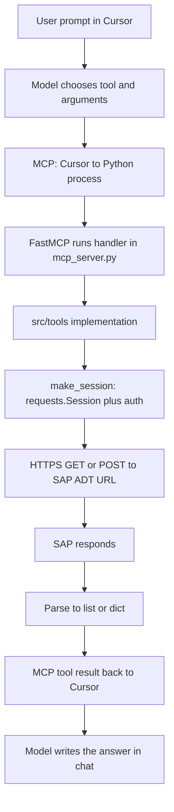

# 🟢 Design

* <mark style="color:$danger;background-color:purple;">**Pre requisite: activate ADT in SICF**</mark>
* Goal: let Cursor (or any MCP client) call ABAP repo operations like other tools—model picks a tool, client sends args, we return data. We sit on SAP **ADT REST** (`/sap/bc/adt/...`), not custom RFC and not SOAP.
* Stack: long-lived Python process, **FastMCP** in `mcp-adt/mcp_server.py` (`mcp = FastMCP("ADT Server")`). Each capability is `@mcp.tool()` on a small handler; name + type hints become the tool schema; handler delegates to `src/tools/*.py` and returns JSON-friendly values (`list[str]`, `dict`, …).
* <mark style="color:$danger;background-color:purple;">**from fastmcp import FastMCP**</mark>
* <mark style="color:$danger;background-color:purple;">**Here we use type as streamable-http, so thats why after deployment when we wanted to add mcp server to our cursor we added it as /**</mark> <mark style="color:$danger;background-color:purple;">**mcp**</mark>
* <mark style="color:$danger;background-color:purple;">**Each tool is defined as @mcp.tool**</mark>
* <mark style="color:$danger;background-color:purple;">**In tool definition we give everything that the tool does, what it needs in input and what it gives in output**</mark>
* <mark style="color:$danger;background-color:purple;">**Inside the tool we did the below:**</mark>
  * <mark style="color:$danger;background-color:purple;">**Create a session from request ⇒ We used basic auth**</mark>
  * <mark style="color:$danger;background-color:purple;">**Form the adt url and call it to get the code**</mark>
  * <mark style="color:$danger;background-color:purple;">**Return the response**</mark>
  * <mark style="color:$danger;background-color:purple;">**For certain tool calls we called wrapper REST API for table contents - DDIF\_TABL\_GET and RFC\_READ\_TABLE**</mark>
* Real work lives in `src/tools/` (e.g. `program_source.py`, `function_source.py`). `mcp_server.py` stays thin.
* **Per tool call:** `make_session()` builds a new **`requests.Session`**: validate env, set TLS verify + timeout, **Basic** auth + default `sap-client` param **or** **JWT** Bearer. Credentials from `.env`, not from Cursor’s `mcp.json`.
* **ADT call:** build `{SAP_URL}/sap/bc/adt/...` for the object (programs, FMs under function group, `oo/` for classes, etc.). Source reads: mostly **`GET`**, prefer abapsource **XML**, on **406** retry same URL with **plain text**; parse with `xmltodict` / `adt_abapsource.py` (regex fallback); **`AdtError`** on bad HTTP. Some features (where-used, package tree, SQL preview) use **`POST`**—same session-per-call idea, different path/body.
* **Lifecycle:** MCP process runs **once** until restart; **`requests.Session` is new per tool run** (no global reused session in `utils.py`).
* **Deploy / Cursor:** local = `--transport stdio` (Cursor starts Python). Remote: same `mcp_server.py` with **`--transport sse`** or **`--transport streamable-http`**—**no code changes** for streamable HTTP; only the flag, `FASTMCP_HOST`/`FASTMCP_PORT`, and TLS at the proxy. In **`mcp.json`** (Tools & MCP) set **`url`** to the endpoint that matches the transport: with **FastMCP defaults**, **SSE** is usually **`https://<host>/sse`**, **streamable HTTP** is **`https://<host>/mcp`** (path **`/mcp`**). If the path does not match what the server is running, Cursor will not connect.
* **`/mcp` is not a global MCP rule**—it is the **default HTTP route** where **FastMCP** mounts the **streamable HTTP** handler (same idea as **`/sse`** for SSE). Cursor’s `url` must hit **whatever path your server actually exposes**; if ops change the mount (FastMCP / proxy config), the URL changes too—it is not fixed for all MCP servers in the world.
* One SAP technical user per server by default; logs in `mcp_server.log`. Multi-user SAP identity would need a deliberate extension.

End-to-end flow (one tool invocation):

